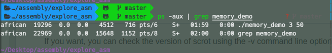
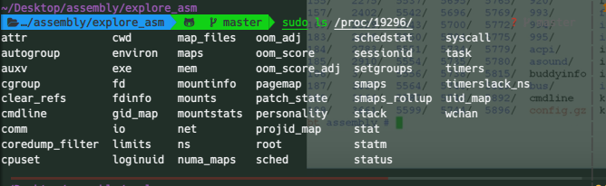
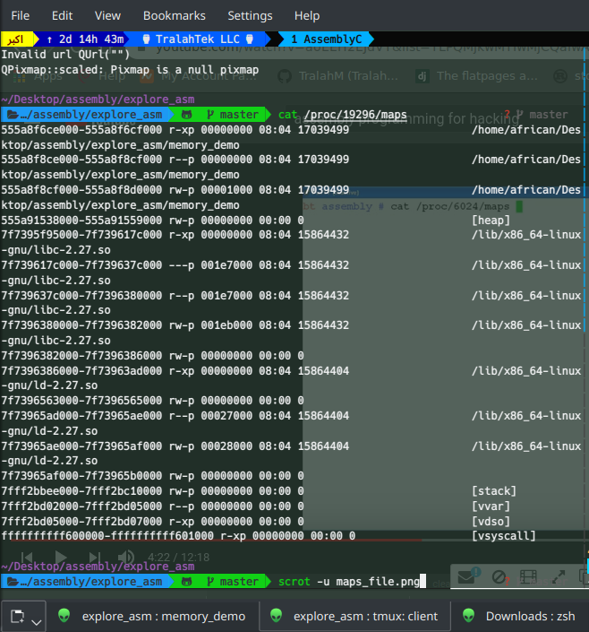

Examing Memory,stack and registers in a simple C program using GDB
====================================================================

The code is a very simple program to add two integers passed as command line arguments and
prints a string with the result

.. include:: memory_demo.c
   :code: c

Compile using the command below and call the executable with some arguments..

.. code:: console

   $ gcc -ggdb -o memory_demo memory_demo.c
   $ ./memory_demo 32 23

In another separate window lets obtain the process id( **pid** ) of the program with

.. code:: console

   $ ps -aux | grep memory_demo

The result should look like

In the linux filesystem the **/proc/** contains the runtime information associated with all running
processes  and thus you should find a directory in this directory with a name corresponding
to the process id you obtained above.

Our interest is the *maps* file which contains the memory layout in virtual memory

.. code:: console

   $ cat /proc/YOUR_PID/maps

