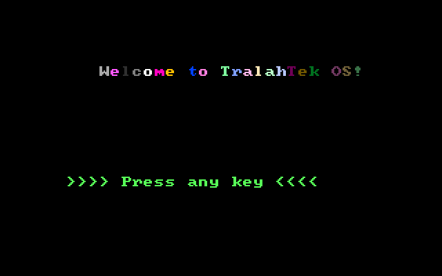
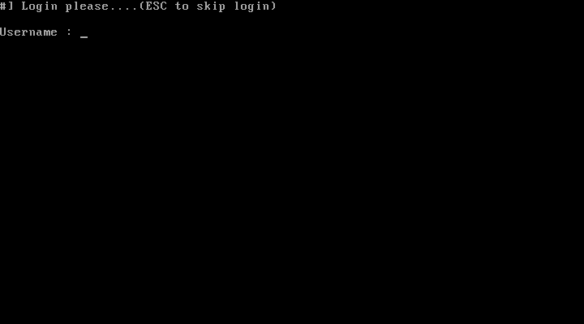
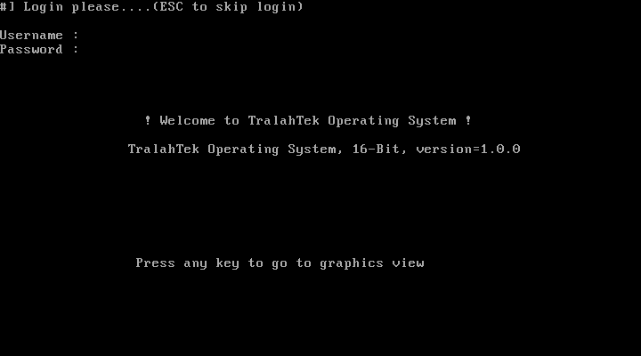
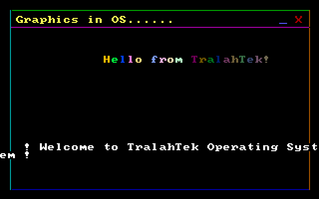

[](https://travis-ci.com/TralahM/explore_asm)
[](https://opensource.org/licenses/MIT)
[](https://github.com/TralahTek)
[](https://www.python.org/)
[](http://dwyl.io/TralahM/explore_asm)
[](http://inch-ci.org/github/TralahM/explore_asm)
[](https://github.com/TralahM/pull/)
[](https://gitHub.com/TralahM/explore_asm/pull/)
[](https://github.com/TralahM/explore_asm).

# explore_asm.

# Description
Exploring Assembly Programming for embedded systems
- 16-bit
- 32-bit
- 64-bit
- x86 intel cpu architectures

[](https://github.com/TralahM)
[](https://github.com/TralahM)

# Screenshots









# Dependencies
- Qemu
- Nasm
- Xlang
- GCC/G++


```Bash
git clone https://github.com/TralahM/explore_asm.git
cd explore_asm
nasm my_custom_os
nasm hello_world
nasm bootloader
```

# Contributing
[See the Contributing File](CONTRIBUTING.rst)


[See the Pull Request File](PULL_REQUEST_TEMPLATE.md)


# Support

# LICENCE
[Read the license here](LICENSE)


